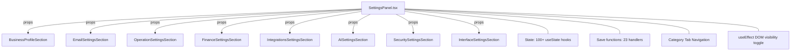
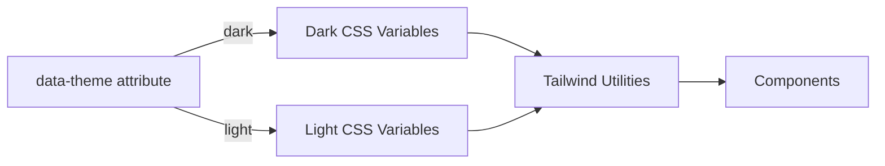

# Design Document: Settings Panel Split & Light Theme

## Overview

This design addresses the decomposition of a 4200+ line monolithic `SettingsPanel.tsx` into focused sub-components (Phase 1) and introduces a light theme layer leveraging existing CSS variable infrastructure (Phase 2).

**Phase 1** extracts 5 section components (Operations, Finance, Integrations, AI, Security, Interface) to join the already-extracted `BusinessProfileSection` and `EmailSettingsSection`. The extraction preserves the existing DOM ID–based visibility toggling, shared state architecture, flash notifications, and role-based access control.

**Phase 2** builds on the existing Tailwind CSS variable system (already defined in `tailwind.config.ts`) to add light-mode variable mappings, then progressively adapts hardcoded dark-palette classes across 100+ components.

### Key Design Decisions

| Decision | Choice | Rationale |
|----------|--------|-----------|
| State sharing | Props (not Context) | Existing pattern already uses props (see BusinessProfileSection, EmailSettingsSection). Context adds indirection for zero benefit since all sections are direct children of SettingsPanel. Keeps refactoring incremental and reversible. |
| DOM ID visibility | Sections keep their `id` attributes; `useEffect` in SettingsPanel remains unchanged | The visibility toggle targets elements by ID. As long as extracted components render the same root `<div id="sec-*">`, the existing `useEffect` works without modification. |
| File organization | One file per section in `src/components/admin/settings/` | Matches existing pattern (`BusinessProfileSection.tsx`, `EmailSettingsSection.tsx`). |
| Theme approach | CSS variables (extend existing `tailwind.config.ts` hsl variables) | Tailwind config already uses `hsl(var(--*))` tokens. Adding `[data-theme="light"]` variable overrides is the lowest-friction path. |
| Extraction strategy | One section at a time, each validated before the next | Reduces blast radius. Each extraction is a single PR-able unit. |

---

## Architecture

### Phase 1: Component Extraction



**SettingsPanel remains the orchestrator**: It owns all state, all save functions, the tab strip, and the `useEffect` that toggles section visibility. Extracted components are pure rendering children.

### Phase 2: Theme Layer



The existing `tailwind.config.ts` already defines semantic tokens (`background`, `foreground`, `card`, `primary`, etc.) mapped to CSS variables. Phase 2 adds the `:root[data-theme="light"]` variable definitions.

---

## Components and Interfaces

### Shared Props Pattern

Each extracted section follows the established interface pattern:

```typescript
interface SectionProps {
  // Core
  lang: string;
  saveButtonClass: string;
  renderPanelSuccess: (panelId: string) => React.ReactNode;
  
  // Section-specific state + setters
  [stateVar]: StateType;
  [setStateVar]: React.Dispatch<React.SetStateAction<StateType>>;
  
  // Section-specific save handlers
  [saveHandler]: () => Promise<void>;
}
```

### Component Inventory

| Component | File | Section IDs | State Variables | Save Functions |
|-----------|------|-------------|-----------------|----------------|
| `OperationSettingsSection` | `settings/OperationSettingsSection.tsx` | sec-print, sec-zreport, sec-tables, sec-beverage | printSettings, zReportReceiptSettings, tableServiceSettings, beverageServiceSettings + printer state | savePrintSettings, saveZReportReceiptSettings, saveTableServiceSettings, saveBeverageServiceSettings |
| `FinanceSettingsSection` | `settings/FinanceSettingsSection.tsx` | sec-bankfee, sec-finance, sec-yield | bankCommission, financePolicy, yieldManagement + inventoryCatalog | saveBankCommission, saveFinancePolicy, saveYieldManagement |
| `IntegrationsSettingsSection` | `settings/IntegrationsSettingsSection.tsx` | sec-delivery, sec-qr, sec-feedback | deliveryIntegrations, qrMenuSettings, feedbackSettings + deliveryMenuMappings | saveDeliveryIntegrations, saveQrMenuSettings, saveFeedbackSettings |
| `AISettingsSection` | `settings/AISettingsSection.tsx` | sec-ai | aiApiKey + menuCatalog, inventoryCatalog | saveAiApiKey |
| `SecuritySettingsSection` | `settings/SecuritySettingsSection.tsx` | sec-security, sec-staff, sec-roles, sec-password, sec-users, sec-danger | staffBenefits, roleModules, users + TOTP state, user management state | saveStaffBenefits, saveRoleModules, handleCreateUser, handleDeleteUser, handleUpdatePin, handleUpdatePasswordForUser, handleChangeOwnPassword, TOTP handlers, resetSystem |
| `InterfaceSettingsSection` | `settings/InterfaceSettingsSection.tsx` | sec-interface | sessionSettings | saveSessionSettings, changeThemeMode, toggleVirtualKeyboard |

### Prop Grouping Strategy

For components with many props (SecuritySettingsSection has 20+ props), group related state into objects:

```typescript
// Instead of 20 individual props:
interface SecuritySettingsSectionProps {
  lang: string;
  saveButtonClass: string;
  renderPanelSuccess: (panelId: string) => React.ReactNode;
  
  // User management group
  users: any[];
  newUserName: string;
  setNewUserName: (v: string) => void;
  newUserRole: 'staff' | 'kitchen' | 'manager' | 'admin';
  setNewUserRole: (v: 'staff' | 'kitchen' | 'manager' | 'admin') => void;
  // ... remaining user props
  
  // Staff benefits group
  staffBenefits: StaffBenefitsState;
  setStaffBenefits: React.Dispatch<React.SetStateAction<StaffBenefitsState>>;
  saveStaffBenefits: () => Promise<void>;
  
  // Role modules group
  roleModules: RoleModules;
  setRoleModules: React.Dispatch<React.SetStateAction<RoleModules>>;
  saveRoleModules: () => Promise<void>;
  
  // ... etc
}
```

### SettingsPanel After Extraction (Orchestrator Shape)

```typescript
export default function SettingsPanel() {
  // === ALL STATE remains here (100+ useState) ===
  // === ALL SAVE FUNCTIONS remain here (23 handlers) ===
  // === Data loading (loadData) remains here ===
  
  // === Tab navigation ===
  const [activeSettingsCategory, setActiveSettingsCategory] = useState('general');
  
  // === DOM visibility toggle (unchanged) ===
  useEffect(() => { /* existing getElementById toggle logic */ }, [activeSettingsCategory]);
  
  return (
    <div className="flex flex-col gap-4">
      {/* Tab Strip (unchanged) */}
      <div className="sticky top-0 z-20 ...">...</div>
      
      {/* Section Components */}
      <div className="min-w-0 flex-1 space-y-6">
        <BusinessProfileSection {...businessProfileProps} />
        <EmailSettingsSection {...emailProps} />
        <OperationSettingsSection {...operationProps} />
        <FinanceSettingsSection {...financeProps} />
        <IntegrationsSettingsSection {...integrationsProps} />
        <AISettingsSection {...aiProps} />
        {['admin', 'super_admin'].includes(currentRole) && (
          <SecuritySettingsSection {...securityProps} />
        )}
        <InterfaceSettingsSection {...interfaceProps} />
      </div>
    </div>
  );
}
```

---

## Data Models

### State Types (to be exported from a shared types file)

```typescript
// src/components/admin/settings/types.ts

export interface PrintSettingsState {
  use_qz: boolean;
  printer_name: string;
  kitchen_printer_name: string;
  auto_print_kitchen_ticket: boolean;
  auto_print_receipt: boolean;
  paper_width: '58mm' | '80mm';
  print_engine: 'pixel_html' | 'raw_escpos';
}

export interface ZReportReceiptSettingsState {
  show_operator: boolean;
  show_date_range: boolean;
  show_sales_summary: boolean;
  show_profit_summary: boolean;
  show_wage: boolean;
  show_shift_cash: boolean;
  show_cash_movements: boolean;
  show_other_income: boolean;
  show_other_expense: boolean;
  show_deposit_summary: boolean;
  show_cashier_breakdown: boolean;
  show_item_breakdown: boolean;
  show_counts: boolean;
}

export interface SessionSettingsState {
  idle_logout_minutes: string;
  virtual_keyboard_enabled: boolean;
  staff_pin_length: 4 | 6;
  theme_mode: 'dark' | 'light';
  ui_mode: 'old';
  login_background_url: string;
}

export interface BeverageServiceSettingsState {
  coffee_selection_mode: 'size_only' | 'size_and_service';
  remove_paper_packaging_for_table: boolean;
  discount_scope: 'all_items' | 'coffee_only';
  summer_promo_enabled: boolean;
}

export interface BankCommissionState {
  card_sale_percent: string;
  card_transfer_percent: string;
}

export interface FinancePolicyState {
  large_transfer_threshold_azn: string;
  investor_repayment_requires_approval: boolean;
  cash_adjustment_requires_approval: boolean;
  reversal_requires_approval: boolean;
  reconciliation_adjustment_requires_approval: boolean;
  reconciliation_variance_alert_azn: string;
  negative_balance_alert_azn: string;
  approver_roles: string;
}

export interface YieldManagementState {
  enabled: boolean;
  variance_tolerance_percent: string;
  beef_ratio: string;
  beef_loss_min_percent: string;
  beef_loss_max_percent: string;
  chicken_ratio: string;
  chicken_loss_min_percent: string;
  chicken_loss_max_percent: string;
  tracked_items: Array<{
    inventory_name: string;
    meat_type: 'beef' | 'chicken';
    raw_to_ready_ratio: string;
    enabled: boolean;
  }>;
}

export interface StaffBenefitsState {
  daily_limit_azn: string;
  allowed_scope: 'all' | 'categories' | 'items';
  included_categories: string[];
  included_items: string[];
  item_unit_cap_azn: string;
  coffee_unit_cap_azn: string;
  other_unit_cap_azn: string;
}

export type RoleModules = { staff: string[]; manager: string[]; kitchen: string[] };

export interface DeliveryIntegrationsState {
  bolt_food_enabled: boolean;
  bolt_food_provider_id: string;
  bolt_food_secret_key: string;
  wolt_enabled: boolean;
  wolt_venue_id: string;
  wolt_client_secret: string;
}
```

### Theme Variables (Phase 2)

```css
/* src/styles/theme.css */

:root,
:root[data-theme="dark"] {
  --background: 222 47% 6%;       /* slate-950 */
  --foreground: 210 40% 93%;      /* slate-100 */
  --card: 222 47% 9%;             /* slate-900 */
  --card-foreground: 210 40% 93%;
  --popover: 222 47% 9%;
  --popover-foreground: 210 40% 93%;
  --primary: 187 80% 55%;         /* cyan-400 */
  --primary-foreground: 222 47% 6%;
  --secondary: 217 33% 17%;       /* slate-800 */
  --secondary-foreground: 210 40% 80%;
  --muted: 217 33% 17%;
  --muted-foreground: 215 20% 65%;
  --accent: 48 96% 53%;           /* yellow/gold */
  --accent-foreground: 222 47% 6%;
  --destructive: 0 84% 60%;
  --destructive-foreground: 210 40% 98%;
  --border: 217 33% 25%;          /* slate-700 */
  --input: 217 33% 17%;
  --ring: 187 80% 55%;
}

:root[data-theme="light"] {
  --background: 210 40% 98%;      /* slate-50 */
  --foreground: 222 47% 11%;      /* slate-900 */
  --card: 0 0% 100%;              /* white */
  --card-foreground: 222 47% 11%;
  --popover: 0 0% 100%;
  --popover-foreground: 222 47% 11%;
  --primary: 187 80% 42%;         /* cyan-600 for better contrast on light */
  --primary-foreground: 0 0% 100%;
  --secondary: 210 40% 96%;       /* slate-100 */
  --secondary-foreground: 222 47% 20%;
  --muted: 210 40% 96%;
  --muted-foreground: 215 16% 47%;
  --accent: 48 96% 40%;           /* amber-600 for contrast */
  --accent-foreground: 0 0% 100%;
  --destructive: 0 84% 50%;
  --destructive-foreground: 0 0% 100%;
  --border: 214 32% 85%;          /* slate-300 */
  --input: 214 32% 91%;           /* slate-200 */
  --ring: 187 80% 42%;
}
```

---

## Correctness Properties

*A property is a characteristic or behavior that should hold true across all valid executions of a system—essentially, a formal statement about what the system should do. Properties serve as the bridge between human-readable specifications and machine-verifiable correctness guarantees.*

### Property 1: Render Equivalence (Round-Trip)

*For any* valid settings state configuration, each extracted Section_Component SHALL produce the same DOM structure (element IDs, class names, input values, text content) as the original inline code in SettingsPanel for identical state values.

**Validates: Requirements 1.4, 8.4**

### Property 2: State Propagation Correctness

*For any* state variable shared between SettingsPanel and its Section_Components, and for any valid value of that variable, calling the setter function from within a Section_Component SHALL result in the updated value being reflected in all other Section_Components that read the same variable.

**Validates: Requirements 1.2, 8.2**

### Property 3: Role-Based Security Gating

*For any* user role that is NOT in the set {admin, super_admin}, the Security category tab SHALL not appear in the rendered tab strip, and the SecuritySettingsSection component SHALL not be present in the DOM.

**Validates: Requirements 5.3**

### Property 4: Category Tab Visibility Filtering

*For any* selected category from the set {all, general, operations, finance, integrations, ai, security, interface}, exactly the sections whose `cat` field matches the selected category SHALL have `display: ''` (visible), and all other sections SHALL have `display: 'none'`. When category is "all", all sections SHALL be visible.

**Validates: Requirements 7.1, 7.2**

---

## Error Handling

### Phase 1: Extraction

| Scenario | Handling |
|----------|----------|
| Save function throws | Error is caught in the save handler (existing pattern). `notify('error', message)` is called. State is not rolled back (matches current behavior). |
| Data loading fails | `Promise.allSettled` pattern continues. Individual failures notify the user but don't block other sections from rendering. |
| Component render error | Add React ErrorBoundary around each section component so a failure in one section doesn't crash the entire settings panel. |
| Missing props at runtime | TypeScript interfaces enforce required props at compile time. Runtime: components render with default/empty state gracefully (existing pattern uses `|| ''` and `?? defaults`). |

### Phase 2: Theme

| Scenario | Handling |
|----------|----------|
| Invalid/missing theme_mode | Fall back to `'dark'` (Requirement 14.4). Applied before first paint in App root. |
| Theme save fails | Revert local state to previous value (existing `changeThemeMode` pattern). Notify user of error. |
| CSS variable not defined | Tailwind config always resolves to `hsl(var(--*))`. Missing variable = transparent. Mitigated by defining all variables in both theme blocks. |
| FOUC on load | Apply `data-theme` from stored settings synchronously in `<script>` before React hydrates, or in the App component's first render. |

---

## Testing Strategy

### Unit Tests (Example-Based)

- **Per-section rendering**: Each extracted component renders with mock props and produces expected DOM IDs and structure.
- **Save handler invocation**: Clicking save buttons invokes the correct handler and triggers flash notification.
- **Tab strip completeness**: All expected categories render with correct icons and labels.
- **Theme variable definitions**: Both `dark` and `light` variable sets define all required tokens.
- **Contrast verification**: Light theme color pairs meet WCAG AA ratio (4.5:1 for body text, 3:1 for large text).

### Property-Based Tests

Property-based testing applies to the core correctness properties of this refactoring:

- **Library**: [fast-check](https://github.com/dubzzz/fast-check) (already common in TypeScript projects)
- **Minimum iterations**: 100 per property
- **Tag format**: `Feature: settings-split-and-light-theme, Property {N}: {title}`

| Property | Generator Strategy |
|----------|-------------------|
| Render Equivalence | Generate random valid state objects for each section (arbitrary strings for text fields, booleans for toggles, constrained numbers for numeric fields). Compare extracted component output to reference. |
| State Propagation | Generate a random state variable name and random valid value. Set via one section's setter, read from another section's binding. |
| Role-Based Gating | Generate random role strings from the full set (staff, kitchen, manager, admin, super_admin, plus arbitrary strings). Verify security section visibility based on role membership. |
| Category Visibility | Generate a random category selection. Verify DOM visibility state of all sections matches the category→section mapping. |

### Integration Tests

- Full SettingsPanel renders and tab switching shows/hides correct sections.
- Save flows persist to backend (mocked Supabase) and flash notifications appear.
- Theme toggle persists and applies `data-theme` attribute.

### Phase 2 Visual Regression

- Storybook snapshots of key components in both dark and light themes.
- Manual accessibility audit with contrast checkers for the light palette.
