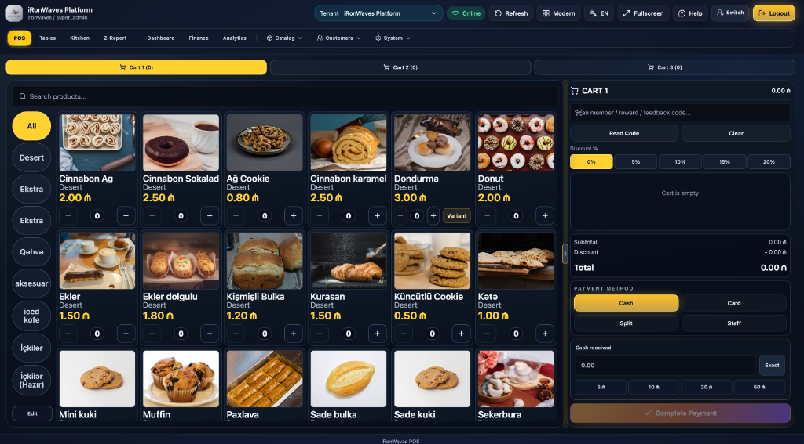
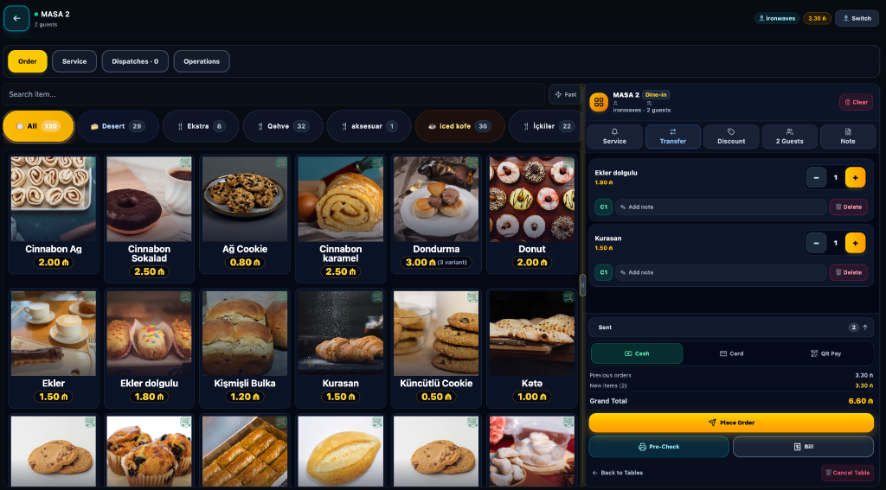
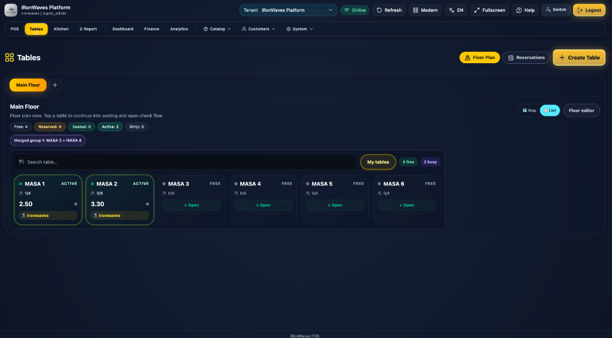
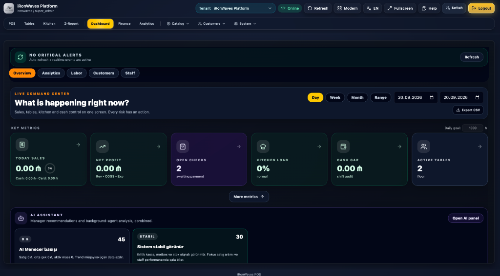
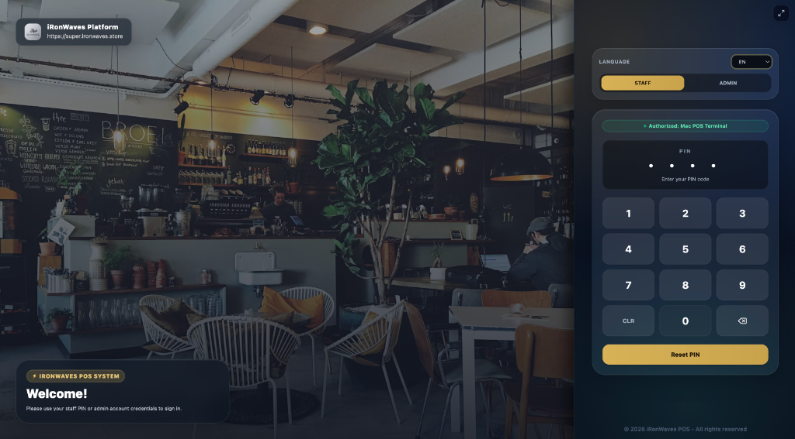
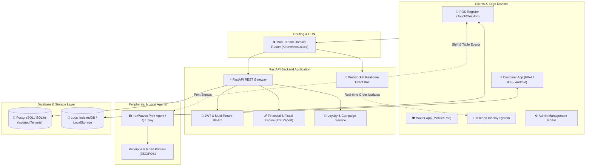

<div align="center">

# IronWaves POS Platform ⚡

### Cloud-Native Multi-Tenant Point of Sale, Kitchen Display System (KDS) & Hospitality ERP

[](https://opensource.org/licenses/MIT)
[](https://github.com/Enjoyer09/ironwaves-pos-platform/releases)
[](https://demo.ironwaves.store)
[](https://github.com/Enjoyer09/ironwaves-pos-platform/commits/main)
[](https://react.dev/)
[](https://fastapi.tiangolo.com/)
[](https://python.org)
[](https://www.typescriptlang.org/)
[](https://capacitorjs.com/)
[](https://tailwindcss.com/)
[](https://railway.app)
[](#internationalization)

<br/>

**IronWaves POS Platform** is an enterprise-ready, open-source point of sale, real-time kitchen orchestration, and retail ERP platform built from the ground up for high-tempo restaurants, specialty coffee shops, retail stores, and multi-branch venues.

[Live Demo](https://demo.ironwaves.store) · [Visual Tour](#-visual-showcase--platform-tour) · [Key Modules](#-key-modules) · [Architecture](#-system-architecture) · [Quickstart](#-getting-started) · [Contributing](./CONTRIBUTING.md) · [License](./LICENSE)

</div>

---

## 🌟 Highlights & Value Proposition

- 🚀 **Built for Real Operations**: Over **1,450+ commits** of continuous production engineering and iterative refinement.
- ⚡ **Sub-100ms Latency**: Touch-first ergonomic cash register designed for rapid ordering during peak queue hours.
- 🍳 **Full Kitchen Orchestration**: Real-time multi-station Kitchen Display System (KDS) with sound alerts and course controls.
- 📱 **Customer App & Loyalty**: Apple iOS-inspired customer web app with digital QR loyalty cards, Starbucks-style store pickers, and pre-orders.
- 🍽️ **Waiter & Tables Flow**: Native mobile and iPad optimized table layout with seat split billing and guest pickers.
- 🔒 **Multi-Tenant Architecture**: Strict schema isolation with subdomain-based routing, role-based access control (RBAC), and centralized management.
- 🖨️ **Direct Hardware Printing**: Silent ESC/POS network printing, QZ Tray support, and cross-platform desktop print agents.
- 💰 **Fiscal Accuracy**: Auditable X/Z register shift reconciliation, strict `decimal.js` monetary calculations, and VAT ledger compliance.

---

## 📸 Visual Showcase & Platform Tour

<div align="center">
  <table border="0" style="border-collapse: collapse; border: none;">
    <tr>
      <td width="50%" align="center">
        <a href="./docs/screenshots/02-pos-register.png">
          
        </a>
        <br/>
        <sub><b>🛒 High-Speed Touch POS Register</b><br/>Multi-cart tabs, rapid category filters & split tender payments</sub>
      </td>
      <td width="50%" align="center">
        <a href="./docs/screenshots/03-table-order.png">
          
        </a>
        <br/>
        <sub><b>🍽️ Table Dine-In & Waiter Pad</b><br/>Item variants, seat assignments, fast modifier notes & instant billing</sub>
      </td>
    </tr>
    <tr>
      <td width="50%" align="center">
        <a href="./docs/screenshots/04-tables-floor-plan.png">
          
        </a>
        <br/>
        <sub><b>🗺️ Interactive Floor Plan & Tables</b><br/>Real-time table occupancy, merged tables & reservations tracking</sub>
      </td>
      <td width="50%" align="center">
        <a href="./docs/screenshots/05-dashboard-command-center.png">
          
        </a>
        <br/>
        <sub><b>📊 Live Command Center & AI Insights</b><br/>Real-time revenue, kitchen load, cash drawer gap & AI manager reports</sub>
      </td>
    </tr>
    <tr>
      <td colspan="2" align="center">
        <a href="./docs/screenshots/01-login-terminal.png">
          
        </a>
        <br/>
        <sub><b>🔐 Terminal Lock & Quick PIN Authentication</b><br/>Role-based access (Staff / Admin) with instant cashier switching</sub>
      </td>
    </tr>
  </table>
</div>


---

## 🧩 Key Modules

### 1. 🛒 High-Speed Point of Sale (POS)
- **Ergonomic Touch Interface**: Designed specifically for 10"–15" touchscreen terminals and iPads.
- **Lightning Product Search**: Filter by categories, barcode scanning listeners, and instant favorites.
- **Cart & Order Customization**: Variants, custom add-ons, item notes, course assignments, and line-item discounts.
- **Flexible Tenders**: Multi-split payments (Cash, Credit/Debit Card, Store Credit, Loyalty Points, Gift Voucher).
- **Offline Resilience**: Local state caching allows uninterrupted operations during momentary internet drops.

### 2. 🍳 Kitchen Display System (KDS)
- **Real-Time Ticket Routing**: Orders dispatched directly from POS or customer mobile apps without printing paper slips.
- **Multi-Station Dispatch**: Filter tickets by station (Hot Line, Cold Prep, Barista / Drinks, Bakery).
- **Time-Aware Urgency**: Color-coded ticket aging (Green ➜ Yellow ➜ Red) with auditory alert pings for rush tickets.
- **Course & Batch Control**: Hold, fire, ready, and bump controls for fine dining or fast-casual pacing.

### 3. 📱 Customer Loyalty & Mobile Experience (PWA & iOS/Android)
- **Apple iOS Design Language**: Minimalist glassmorphism and solid surfaces with SF Pro typography.
- **Digital Loyalty Pass**: Dynamic flip-card QR member pass with cryptographic tokens to prevent replay attacks.
- **Gamified Rewards & Tiers**: Bronze, Silver, and Gold tiers based on lifetime stars with automated birthday surprises.
- **Store Selection**: Haversine distance calculations showing the nearest branch with opening hours.
- **Pre-Order & Self-Checkout**: Skip-the-line pre-ordering with live order progress status (Preparing ➜ Ready ➜ Picked Up).

### 4. 🍽️ Tables & Waiter Management
- **Interactive Floor Plan**: Visual table layout with status indicators (Free, Occupied, Bill Requested, Reserved).
- **Mobile Waiter Pad**: Optimized 1-hand mobile flow with an instant guest counter, course firings, and seat split bills.
- **Table Operations**: Instant table transfers, bill merges, and waitstaff assignments.

### 5. 📊 Fiscal Shift Management & Financial Audits
- **Automated Register Shifts**: Shift opening float entry, real-time cash drawer tracking, and blind close counts.
- **Official Fiscal Reports**: Instant generation of X-Reports (interim) and Z-Reports (fiscal day closing).
- **Discrepancy Audits**: Automatic variance detection between expected and counted cash amounts.
- **Comprehensive Analytics**: Revenue heatmaps, top-selling items, employee performance, and gross margin reporting.

### 6. 🖨️ Hardware & Local Printing Engine
- **Cross-Platform Compatibility**: Windows, macOS, and Linux support.
- **Silent Thermal Slips**: Generates clean 80mm and 58mm ESC/POS thermal receipts and kitchen prep slips.
- **Zero-Dialog Printing**: Background printing via QZ Tray WebSocket bridge or the native `ironwaves-print-agent`.

---

## 🏗️ System Architecture



---

## 💻 Tech Stack

| Layer | Technologies |
| :--- | :--- |
| **Frontend UI** | React 19, TypeScript, Vite, Tailwind CSS, Lucide Icons, Recharts |
| **Mobile & Native** | Capacitor 8 (iOS & Android native runtime), PWA Service Workers |
| **Backend API** | FastAPI (Python 3.12+), Pydantic v2, SQLAlchemy, AsyncIO |
| **Realtime** | WebSockets (KDS sync, table status broadcasts, print events) |
| **Database** | PostgreSQL (Production), SQLite (Local Dev & Unit Tests), Alembic |
| **Printing & Peripherals** | QZ Tray API, Raw ESC/POS generator, Custom Node.js Print Agent |
| **Internationalization** | `react-i18next` with full trilingual support (**Azərbaycan**, **English**, **Русский**) |
| **DevOps & Cloud** | Docker, Nixpacks, Railway Platform, GitHub Actions CI/CD |

---

## 🚀 Getting Started

### Prerequisites
- **Node.js**: `v20.x` or `v22.x` (LTS recommended)
- **Python**: `3.11` or `3.12+`
- **Git**

### 1. Clone the Repository
```bash
git clone https://github.com/Enjoyer09/ironwaves-pos-platform.git
cd ironwaves-pos-platform
```

### 2. Backend Setup
```bash
# Navigate to backend directory
cd backend

# Create and activate virtual environment
python3 -m venv .venv
source .venv/bin/activate  # On Windows: .venv\Scripts\activate

# Install dependencies
pip install -r requirements.txt
pip install -r requirements-dev.txt

# Run database migrations (optional for development)
# alembic upgrade head

# Start FastAPI development server
uvicorn app.main:app --reload --port 8000
```
Backend will be live at: `http://localhost:8000`  
Interactive API Docs (Swagger): `http://localhost:8000/docs`

### 3. Frontend Setup
```bash
# In project root directory
npm install

# Launch Vite development server
npm run dev
```
Frontend will be accessible at: `http://localhost:5173`

### 4. Build for Production
```bash
# Build web SPA
npm run build

# Build customer mobile PWA only
npm run build:customer

# Sync with native iOS Capacitor container
npm run sync:ios:customer
```

---

## 🧪 Testing & Code Quality

IronWaves adheres to rigorous test suites ensuring monetary calculation integrity and operational reliability:

```bash
# Run backend tests
cd backend
python -m pytest

# Run Python syntax & bytecode compilation check
python -m compileall app

# Run frontend build validation
npm run build

# Run local smoke tests
npm run test:smoke
```

---

## 📁 Repository Structure

```text
ironwaves-pos-platform/
├── backend/                  # FastAPI Backend API
│   ├── app/
│   │   ├── core/             # Configuration, security & JWT utilities
│   │   ├── routers/          # API Route Controllers (POS, CRM, Finance, KDS)
│   │   ├── services/         # Business domain logic (Loyalty, Reports, Finance)
│   │   ├── models.py         # SQLAlchemy Data Models
│   │   └── main.py           # FastAPI Entrypoint & WebSocket Router
│   ├── alembic/              # Database Schema Migrations
│   └── tests/                # Pytest unit & integration test suites
├── src/                      # React 19 Frontend SPA
│   ├── api/                  # Typed API Client modules
│   ├── components/           # UI Components
│   │   ├── admin/            # Admin Panel, Settings & CRM dashboard
│   │   ├── CustomerApp.tsx   # Mobile Customer Loyalty App
│   │   ├── POS.tsx           # Cashier Register Point-of-Sale
│   │   ├── KDS.tsx           # Kitchen Display System
│   │   └── TablesPage.tsx    # Floor Plan & Waiter Pad
│   ├── hooks/                # Custom React lifecycle & event hooks
│   ├── i18n/                 # Localization dictionaries (AZ, EN, RU)
│   └── types/                # Strict TypeScript interfaces
├── tools/
│   └── print-agent/          # Native ESC/POS Thermal Print Agent
├── docs/                     # Engineering audits, guides & specifications
├── public/                   # Static assets, PWA manifests, downloads
├── capacitor.config.ts       # iOS & Android Capacitor configuration
├── server.js                 # Production Node.js static & reverse-proxy server
└── railway.json              # Railway Cloud deployment blueprint
```

---

## 🌐 Live Demo & Production Tenants

Explore the platform live in your browser:
- 🚀 **Interactive Public Sandbox**: [**demo.ironwaves.store**](https://demo.ironwaves.store)  
  *(Open to visitors — test high-speed POS, interactive tables, digital cart, and KDS freely without signup)*

Active operational production merchants:
- ☕ `socialbee.ironwaves.store`
- 🍽️ `emalatxana.ironwaves.store`
- 🏢 `super.ironwaves.store`


---

## 🤝 Contributing

We welcome contributions from developers worldwide! Please read our **[Contributing Guide](./CONTRIBUTING.md)** for details on our coding standards, branch conventions, and pull request review process.

---

## 📄 License

This project is licensed under the **MIT License** — see the [LICENSE](./LICENSE) file for details.

---

<div align="center">
  <sub>Engineered with precision for modern commerce. Developed by <a href="https://github.com/Enjoyer09">Abbas Aliyev</a>.</sub>
</div>
