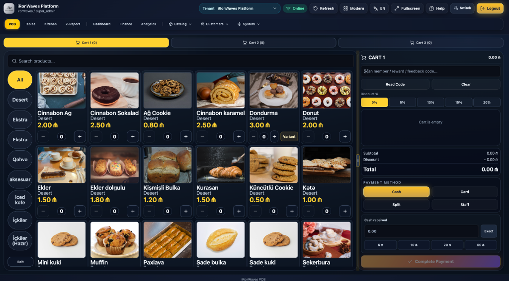
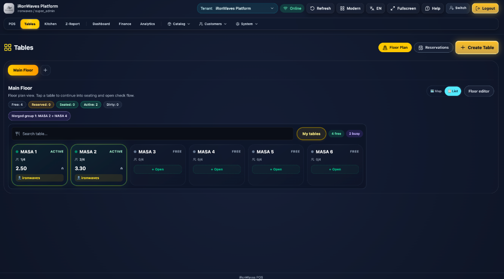
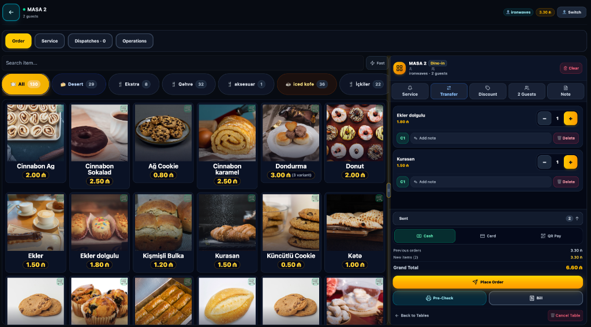
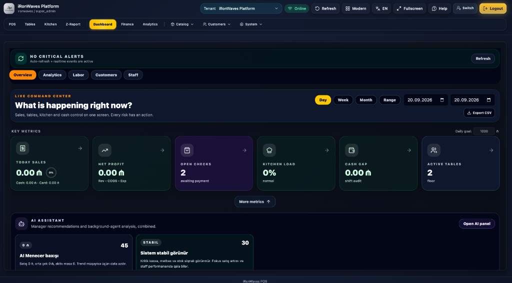
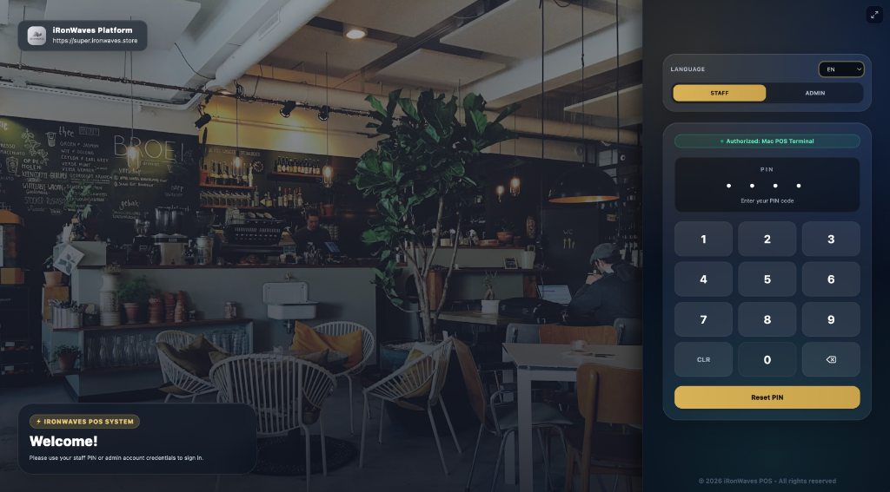
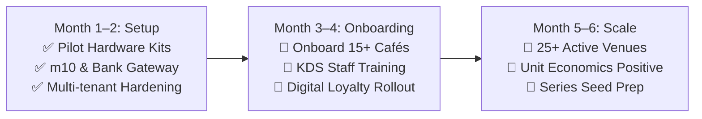

# IronWaves POS Platform ⚡
## Investor & Startup Accelerator Pitch Deck (10,000 – 15,000 AZN Grant / Pre-Seed Support)

> **Tagline:** The Next-Generation Multi-Tenant Cloud POS, Kitchen Display System (KDS) & Hospitality Operating System.  
> **Founder:** Abbas Aliyev ([@Enjoyer09](https://github.com/Enjoyer09))  
> **Live Demo:** [https://demo.ironwaves.store](https://demo.ironwaves.store)  
> **Repository:** [https://github.com/Enjoyer09/ironwaves-pos-platform](https://github.com/Enjoyer09/ironwaves-pos-platform)  
> **Version / Status:** v1.231-RC1 · Production Validated across Active Venues

---

## 📑 Slide Deck Outline (12 Slides)

1. [Slide 1: Executive Summary & Vision](#slide-1-executive-summary--vision)
2. [Slide 2: The Problem: Fragmentation, Latency & High Costs](#slide-2-the-problem-fragmentation-latency--high-costs)
3. [Slide 3: The Solution: The All-in-One Cloud Hospitality OS](#slide-3-the-solution-the-all-in-one-cloud-hospitality-os)
4. [Slide 4: Product Showcase 1 — High-Speed Touch POS](#slide-4-product-showcase-1--high-speed-touch-pos)
5. [Slide 5: Product Showcase 2 — Table Flow & Dine-In Ordering](#slide-5-product-showcase-2--table-flow--dine-in-ordering)
6. [Slide 6: Product Showcase 3 — Live Command Center & AI Copilot](#slide-6-product-showcase-3--live-command-center--ai-copilot)
7. [Slide 7: Product Showcase 4 — Terminal Security & Waiter Mobility](#slide-7-product-showcase-4--terminal-security--waiter-mobility)
8. [Slide 8: Market Opportunity & Target Segments](#slide-8-market-opportunity--target-segments)
9. [Slide 9: Business Model & Revenue Engine](#slide-9-business-model--revenue-engine)
10. [Slide 10: Competitive Advantage & Moat](#slide-10-competitive-advantage--moat)
11. [Slide 11: Real-World Traction & Operational Validation](#slide-11-real-world-traction--operational-validation)
12. [Slide 12: The Ask & 6-Month Milestones](#slide-12-the-ask--6-month-milestones)

---

### Slide 1: Executive Summary & Vision

#### Vision
To replace outdated, slow, and expensive legacy register hardware with a unified, high-performance, and AI-powered cloud operating system that runs seamlessly on any device.

```
       ┌────────────────────────────────────────────────────────┐
       │               IronWaves Cloud Platform                 │
       │     Fast · Modular · Multi-Tenant · AI-Supercharged    │
       └──────────────────────────┬─────────────────────────────┘
          ┌───────────────────────┼───────────────────────┐
          ▼                       ▼                       ▼
    [🛒 POS Register]     [🍳 Smart KDS]         [📱 Customer Loyalty]
    Touch & Barcode       Real-time Routing       Apple iOS V3 PWA
          ▲                       ▲                       ▲
          └───────────────────────┼───────────────────────┘
                                  ▼
                     [📊 Live Financial Engine]
                   X/Z Reports · Fiscal Ledgers
```

- **What IronWaves is**: An end-to-end, multi-tenant POS, Kitchen Display System (KDS), waiter mobile terminal, customer loyalty PWA, and inventory accounting platform.
- **Key Metric**: Sub-100ms checkout interaction latency, driving up to **35% faster customer throughput** during peak service hours.
- **Stage**: Production live across multiple commercial venues (`socialbee.ironwaves.store`, `emalatxana.ironwaves.store`), with an open interactive sandbox at `demo.ironwaves.store`.

---

### Slide 2: The Problem: Fragmentation, Latency & High Costs

Modern restaurants, coffee shops, and retail chains face a broken operational workflow:

| Pain Point | Industry Reality Today | Impact on Merchant |
| :--- | :--- | :--- |
| **SaaS Tool Sprawl** | Merchants juggle 4–6 disconnected vendors (POS, KDS, Loyalty app, Online orders, Floor planner, Inventory). | $400–$900/month/location; zero unified data; constant sync crashes. |
| **Crippling Checkout Latency** | Legacy systems lag 2–4 seconds per item tap or screen transition. | Long queues, lost walk-out revenue, and stressed cashiers during peak rush. |
| **Proprietary Hardware Lock-In** | Legacy vendors force proprietary terminals costing $2,000–$5,000 upfront. | Severe capital expense barriers for new venues and multi-branch expansions. |
| **Zero Offline Resilience** | Cloud POS tools crash or refuse transactions during minor internet hiccups. | Paralyzed operations and missed sales during peak dining hours. |
| **Lack of Actionable AI** | Data is trapped in raw, unreadable end-of-month CSV exports. | Wasteful inventory over-ordering, untracked cash gaps, and slow pricing adjustments. |

---

### Slide 3: The Solution: The All-in-One Cloud Hospitality OS

**IronWaves** unifies the entire front-of-house, back-of-house, customer retention, and accounting stack into one lightweight, cloud-native ecosystem.

- ⚡ **Sub-100ms Interaction Speed**: Optimized React 19 architecture with optimistic UI updates and reactive state caching.
- 📱 **Hardware-Agnostic Freedom**: Runs on any touchscreen register, iPad, Android tablet, MacBook, or mobile phone without proprietary hardware dependencies.
- 🍳 **End-to-End Kitchen Sync**: Orders move instantly from POS or Customer Mobile ➜ Kitchen Display (KDS) ➜ Waiter Pad via bidirectional WebSockets.
- 💳 **Fiscal & Monetary Integrity**: Strict `decimal.js` monetary math guarantees exact cent/qəpik calculation without IEEE 754 floating-point rounding errors.
- 🏢 **Multi-Tenant by Design**: Instant subdomain provisioning (`tenant.ironwaves.store`) with strict schema data segregation and RBAC.

---

### Slide 4: Product Showcase 1 — High-Speed Touch POS

**The Cashier Engine Built for Rapid Queue Busting**

<div align="center">
  
</div>

#### Key Capabilities:
- **Simultaneous Cart Tabs (Cart 1, 2, 3)**: Cashiers can park an order when a guest hesitates and instantly serve the next customer with zero context loss.
- **Lightning Visual Filters**: Category pills (Coffee, Bakery, Dessert, Drinks) with photo tiles and quick stock badges.
- **Split Tender Processing**: Cash, Card, Loyalty points, Gift voucher, and Staff account split payments in a single transaction.
- **Hardware Integration**: Silent thermal receipt printing via direct network sockets, ESC/POS, and QZ Tray.

---

### Slide 5: Product Showcase 2 — Table Flow & Dine-In Ordering

**Dynamic Floor Management & 1-Hand Waiter Pad**

<div align="center">
  <table border="0" style="border-collapse: collapse; border: none;">
    <tr>
      <td width="50%" align="center">
        
        <br/>
        <sub><b>Interactive Floor Map:</b> Real-time table states (Free, Active, Merged, Reserved)</sub>
      </td>
      <td width="50%" align="center">
        
        <br/>
        <sub><b>Table Order Pad:</b> Course management, guest seat assignment & instant pre-check</sub>
      </td>
    </tr>
  </table>
</div>

#### Key Capabilities:
- **Visual Zone Layout**: Manage indoor dining, patio, terrace, and bar stools with live occupancy indicators.
- **Mobile Waiter Pad**: Optimized ergonomics for 1-hand mobile order taking right at the customer's table.
- **Split & Merge**: Group adjacent tables for large parties; split checks by seat or evenly among guests with 1 click.
- **Kitchen Course Pacing**: Mark items for Course 1 (Appetizers), Course 2 (Mains), or Course 3 (Dessert) with timed dispatch.

---

### Slide 6: Product Showcase 3 — Live Command Center & AI Copilot

**Real-Time Executive Intelligence for Store Managers**

<div align="center">
  
</div>

#### Key Capabilities:
- **Live Command Center**: Real-time sales, net profit margins, open checks awaiting payment, and kitchen order load.
- **Cash Drawer Gap Auditing**: Continuous comparison between expected cash in drawer and actual shift tenders.
- **Autonomous AI Assistant**: Embedded AI manager analyzing item velocity, anomaly alerts, and automated restocking recommendations.
- **Instant CSV & Fiscal Export**: Automated X-Report (interim) and Z-Report (fiscal closing) with tax ledgers.

---

### Slide 7: Product Showcase 4 — Terminal Security & Waiter Mobility

**Fast PIN Switching & Customer Loyalty Ecosystem**

<div align="center">
  
</div>

#### Key Capabilities:
- **Swift PIN Authentication**: 4-digit rapid switch between waiters and cashiers prevents order attribution errors.
- **Role-Based Access Control (RBAC)**: Strict permission tiers (Cashier, Waiter, Kitchen Cook, Store Manager, Tenant Admin, Superadmin).
- **Apple iOS V3 Loyalty PWA**: Customer-facing digital wallet pass with dynamic, fraud-proof QR tokens, points accumulation, and Starbucks-style store pickers.

---

### Slide 8: Market Opportunity & Target Segments

```
               Total Addressable Market (TAM)
                Global POS Software Market
                       $29.09 Billion
                             │
                             ▼
              Serviceable Addressable Market (SAM)
            Independent F&B, Cafés & Cloud Kitchens
                        $8.4 Billion
                             │
                             ▼
              Serviceable Obtainable Market (SOM)
            High-Growth Regional Venues & Franchises
                        $140 Million
```

#### Primary Target Customers:
1. **Specialty Coffee Shops & Bakeries**: High queue velocity, custom modifiers, repeat customer loyalty.
2. **Fast-Casual & Dine-In Restaurants**: Floor plan pacing, course routing, split checks, and table turnover speed.
3. **Ghost / Cloud Kitchens**: Real-time multi-station KDS dispatch, multi-brand catalog management.
4. **Franchises & Multi-Branch Operators**: Centralized inventory tracking, tenant isolation, consolidated fiscal reporting.

---

### Slide 9: Business Model & Revenue Engine

IronWaves employs a highly scalable B2B SaaS subscription model paired with high-margin usage-based expansions:

```
┌────────────────────────┐  ┌────────────────────────┐  ┌────────────────────────┐
│     Starter Tier       │  │       Pro Tier         │  │    Enterprise Tier     │
│       $49/month        │  │       $129/month       │  │       $249+/month      │
├────────────────────────┤  ├────────────────────────┤  ├────────────────────────┤
│ • 1 POS Register       │  │ • Up to 3 Registers    │  │ • Unlimited Registers  │
│ • Unlimited Products   │  │ • 2 KDS Displays       │  │ • Multi-Branch Sync    │
│ • Real-time Reports    │  │ • Waiter Mobile Pads   │  │ • Full AI Copilot Hub  │
│ • Thermal Print Agent  │  │ • Loyalty App Engine   │  │ • Dedicated Cloud/SLA  │
└────────────────────────┘  └────────────────────────┘  └────────────────────────┘
```

#### Expansion Revenue Streams:
- **Payment Processing Margin**: 0.20%–0.40% take rate on integrated card & QR merchant processing.
- **AI Copilot Add-On**: $29/month per branch for smart sales forecasting, predictive inventory, and automated re-ordering.
- **White-Label Branded Apps**: $499 setup + $49/mo maintenance for native iOS App Store and Android Play Store apps.

---

### Slide 10: Competitive Advantage & Moat

| Feature | Legacy Systems (iiko, Micros, R-Keeper) | Standard Cloud (Square, Clover) | Enterprise Cloud (Toast) | IronWaves POS Platform ⚡ |
| :--- | :---: | :---: | :---: | :---: |
| **Response Latency** | Slow (2–4s) | Medium (500ms) | Medium (400ms) | **Ultra-Fast (<100ms)** |
| **Hardware Agnostic** | ❌ (Expensive PCs) | ❌ (Proprietary) | ❌ (Proprietary Toast) | **✅ (Any Device / iPad / Web)** |
| **Multi-Tenant Architecture** | ❌ On-Premise | ⚠️ Single Account | ⚠️ Limited Multi-Org | **✅ True Multi-Tenant Subdomains** |
| **Integrated KDS & Tables** | ⚠️ Extra Cost Modules | ⚠️ Basic Add-on | ✅ Advanced | **✅ Native Real-Time WebSockets** |
| **Apple V3 Customer Loyalty** | ❌ Third-party SMS | ⚠️ Basic Loyalty | ⚠️ Add-on Fees | **✅ Built-in iOS PWA with QR Token** |
| **Open-Source Base & Extensibility**| ❌ Closed Silo | ❌ Closed | ❌ Closed | **✅ Open Core & Self-Hostable** |
| **Monthly Cost Per Location** | $250–$600+ | $80–$180+ | $165–$350+ | **$49–$129 (60% Lower TCO)** |

---

### Slide 11: Real-World Traction & Operational Validation

- 🔨 **1,450+ Production Commits**: Continuous iterative development, stress-tested with real merchant transactions.
- 🏪 **Active Commercial Venues**:
  - `socialbee.ironwaves.store` — High-traffic specialty café & roastery.
  - `emalatxana.ironwaves.store` — Boutique dining & artisan bakery.
  - `super.ironwaves.store` — Enterprise platform hub & multi-branch testbed.
- 🌐 **Interactive Public Sandbox**:
  - **[https://demo.ironwaves.store](https://demo.ironwaves.store)** — Instant guest login with pre-loaded mock inventory, active tables, and live order placement.
- 🛡️ **Zero Critical Vulnerabilities**: Robust tenant isolation, JWT authentication, and strict separation between tenant database boundaries.

---

### Slide 12: The Ask & 6-Month Milestones

**Target Funding: 10,000 – 15,000 AZN (Grant / Pre-Seed Support)**

#### 🎯 Strategic Fund Allocation:
- **40% (4,000 – 6,000 AZN) — Merchant Hardware Pilot Kits:** Deployment of thermal printer bridges, 2D barcode scanners, and test tablets for pilot venues across Baku.
- **35% (3,500 – 5,000 AZN) — Cloud Infrastructure & Local Payments:** High-availability database scaling, multi-tenant container hosting, and direct API integration with local payment rails (m10, Kapital Bank / PASHA Bank).
- **25% (2,500 – 4,000 AZN) — B2B Merchant Acquisition:** Direct onboarding, staff training, and support to scale from our current 3 venues to 25+ paying F&B merchants in Baku.




---

<div align="center">
  <h3>Let's Revolutionize Hospitality Technology Together ⚡</h3>
  <p><b>Abbas Aliyev</b> — Founder & Lead Engineer</p>
  <p>
    🌐 <a href="https://demo.ironwaves.store">Live Demo: demo.ironwaves.store</a> · 
    💻 <a href="https://github.com/Enjoyer09/ironwaves-pos-platform">GitHub: Enjoyer09/ironwaves-pos-platform</a>
  </p>
</div>
